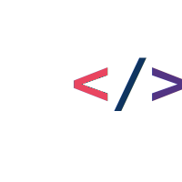

<p align="center">
  
</p>

<h1 align="center">llm-router</h1>

<p align="center">Minimal LLM routing proxy for Claude Code. Zero dependencies, single binary.</p>

<p align="center">
  <a href="https://github.com/mstfknn/llm-router/releases"></a>
  <a href="https://github.com/mstfknn/llm-router/actions"></a>
  <a href="LICENSE"></a>
  
  
</p>

## Why?

Claude Code's agent team and subagent features only support Claude models natively. If you want your subagents to use non-Claude models (Gemini, Qwen, LLaMA, etc.) without paying for a separate Claude API subscription for every agent, you're stuck.

This proxy solves that. It sits between Claude Code and the outside world, inspects the `model` field in each request, and routes accordingly:

- **Claude models** → Anthropic API (pass-through, your existing Claude subscription)
- **Everything else** → your downstream provider (Bifrost, Ollama, vLLM — local or remote)

This means you can run an agent team where the orchestrator uses Claude Opus and subagents use Gemini, Qwen, or any model available through your downstream provider — all without extra API keys or subscriptions. The proxy handles routing transparently.

## Why not LiteLLM?

LiteLLM's PyPI package was hit by a supply chain [attack](https://securitylabs.datadoghq.com/articles/litellm-compromised-pypi-teampcp-supply-chain-campaign/) in March 2026 — versions containing a credential stealer were published.

## Architecture

```text
Claude Code ──→ llm-router (:4000)
                    │
                    ├── claude-* / anthropic/*  ──→ Anthropic API (pass-through)
                    │
                    └── everything else         ──→ downstream (Bifrost / Ollama / vLLM)
```

The proxy reads the `model` field from the JSON request body and routes accordingly. Auth headers (API keys) are passed through untouched — the proxy never requires or stores credentials.

## Routing logic

Model matching is case-insensitive.

| Model prefix    | Backend       | Example                                         |
| --------------- | ------------- | ----------------------------------------------- |
| `claude-*`      | Anthropic API | `claude-sonnet-4-6`                             |
| `anthropic/*`   | Anthropic API | `anthropic/claude-3`                            |
| everything else | downstream    | `gemini/gemini-2.0-flash`, `qwen2.5-coder:32b`  |

## Claude Code Agent Team Integration

The proxy works with Claude Code's agent team feature. The main session uses Claude (routed to Anthropic), while subagents can use non-Claude models (routed to downstream).

### Setup

**1. Project settings** (`.claude/settings.json`):

```json
{
  "env": {
    "ANTHROPIC_BASE_URL": "http://localhost:4000",
    "CLAUDE_CODE_EXPERIMENTAL_AGENT_TEAMS": "1",
    "CLAUDE_CODE_SUBAGENT_MODEL": "gemini/gemini-2.0-flash",
    "ANTHROPIC_CUSTOM_MODEL_OPTION": "gemini/gemini-2.0-flash",
    "ANTHROPIC_CUSTOM_MODEL_OPTION_NAME": "Gemini 2.0 Flash"
  },
  "model": "opus"
}
```

**2. Subagent definition** (`.claude/agents/worker.md`):

```markdown
---
name: worker
tools: Read, Write, Bash
---
You are a coding assistant.
```

> **Important:** Do NOT set `model:` in the subagent frontmatter. When omitted, `CLAUDE_CODE_SUBAGENT_MODEL` takes effect and sends the non-Claude model name to the proxy.

**3. Orchestrator instructions** (`CLAUDE.md`):

```markdown
Delegate coding tasks to the worker subagent.
```

### How it works

```text
Claude Code session (opus)
    │
    ├── orchestrator requests  ──→ proxy ──→ Anthropic API
    │   (model: claude-opus-4-6)
    │
    └── subagent requests      ──→ proxy ──→ downstream (Bifrost)
        (model: gemini/gemini-2.0-flash)
```

### Mixed model subagents

You can have some subagents on Claude and others on non-Claude models:

```markdown
# .claude/agents/claude-reviewer.md (uses Sonnet → Anthropic)
---
name: claude-reviewer
model: sonnet
tools: Read, Grep, Glob
---
```

```markdown
# .claude/agents/gemini-coder.md (no model → uses CLAUDE_CODE_SUBAGENT_MODEL → downstream)
---
name: gemini-coder
tools: Read, Write, Bash
---
```

- Subagents **with** `model: sonnet/opus/haiku` → Anthropic API
- Subagents **without** `model:` field → `CLAUDE_CODE_SUBAGENT_MODEL` env var → downstream

### Key env vars for Claude Code

| Variable                              | Purpose                                                          |
|---------------------------------------|------------------------------------------------------------------|
| `ANTHROPIC_BASE_URL`                  | Point Claude Code to the proxy                                   |
| `CLAUDE_CODE_SUBAGENT_MODEL`          | Model name sent for subagents without explicit `model:` field    |
| `CLAUDE_CODE_EXPERIMENTAL_AGENT_TEAMS`| Enable agent team feature                                        |
| `ANTHROPIC_CUSTOM_MODEL_OPTION`       | Add custom model to `/model` picker                              |
| `ANTHROPIC_CUSTOM_MODEL_OPTION_NAME`  | Display name for custom model in picker                          |

## Security features

- Request body size limit (100MB)
- HTTP server timeouts (read: 30s, write: 120s, idle: 60s)
- Proxy transport timeouts (dial: 10s, TLS handshake: 5s)
- Hop-by-hop header filtering (RFC 7230)
- URL scheme validation (http/https only)
- HTTP method validation (blocks TRACE/CONNECT)
- Token bucket rate limiting (100 req/s, burst 20)
- Proxy error handler (no internal details leaked)
- Log sanitization (credentials masked)
- Graceful shutdown (SIGINT/SIGTERM)
- Structured JSON logging (slog)

## Endpoints

| Path       | Method | Description                              |
|------------|--------|------------------------------------------|
| `/health`  | GET    | Health check (returns `{"status":"ok"}`) |
| `/metrics` | GET    | Request counters (JSON)                  |
| `/*`       | *      | Proxy routing                            |

## Build

Requires Go 1.22+.

```bash
# Quick build
make build

# Cross-compile for all platforms
make release

# Or manually
GOOS=darwin GOARCH=arm64 go build -o llm-router .
```

## Test

```bash
# Via Makefile
make test

# Or directly
go test -v -race ./...
```

## Makefile targets

| Target    | Description                                                            |
|-----------|------------------------------------------------------------------------|
| `build`   | Build binary for current platform                                      |
| `release` | Cross-compile for darwin/arm64, darwin/amd64, linux/amd64, linux/arm64 |
| `test`    | Run all tests with race detector                                       |
| `vet`     | Run go vet                                                             |
| `fmt`     | Format code with gofmt                                                 |
| `run`     | Build and run                                                          |
| `clean`   | Remove build artifacts                                                 |

## Usage

```bash
# Run with Ollama
DOWNSTREAM_URL=http://localhost:11434 \
PROXY_ADDR=:4000 \
./llm-router

# Run with Bifrost (path prefix supported)
DOWNSTREAM_URL=http://your-bifrost-host:8080/anthropic \
PROXY_ADDR=:4000 \
./llm-router
```

### Path prefix

If `DOWNSTREAM_URL` includes a path (e.g. `/anthropic`), it is prepended to the request path:

```text
DOWNSTREAM_URL=http://host:8080/anthropic
POST /v1/messages → http://host:8080/anthropic/v1/messages
```

### Quick test

```bash
# Health check
curl http://localhost:4000/health

# Metrics
curl http://localhost:4000/metrics

# Route to Anthropic (Claude Code sends its own auth headers, proxy just passes them through)
curl -X POST http://localhost:4000/v1/messages \
  -H "Content-Type: application/json" \
  -H "anthropic-version: 2023-06-01" \
  -d '{"model":"claude-haiku-4-5-20251001","max_tokens":5,"messages":[{"role":"user","content":"hi"}]}'

# Route to downstream
curl -X POST http://localhost:4000/v1/messages \
  -H "Content-Type: application/json" \
  -d '{"model":"gemini/gemini-2.0-flash","messages":[{"role":"user","content":"hi"}]}'
```

## Docker

```bash
docker build -t llm-router .
docker run -e DOWNSTREAM_URL=http://host.docker.internal:8080 \
           -p 4000:4000 llm-router
```

## Releases

Binaries are automatically built and published via GitHub Actions when a tag is pushed:

```bash
git tag v1.2.0
git push origin v1.2.0
```

Pre-built binaries for macOS (Apple Silicon, Intel) and Linux (amd64, arm64) will be available on the [Releases](../../releases) page with SHA256 checksums.

## Env vars

| Var              | Default                | Description                                            |
|------------------|------------------------|--------------------------------------------------------|
| `DOWNSTREAM_URL` | `http://localhost:8080` | Downstream provider address (Ollama, Bifrost, vLLM...) |
| `PROXY_ADDR`     | `:4000`                | Listen port                                            |

## Star History

<a href="https://www.star-history.com/?repos=mstfknn%2Fllm-router&type=date&legend=top-left">
 <picture>
   <source media="(prefers-color-scheme: dark)" srcset="https://api.star-history.com/image?repos=mstfknn/llm-router&type=date&theme=dark&legend=top-left" />
   <source media="(prefers-color-scheme: light)" srcset="https://api.star-history.com/image?repos=mstfknn/llm-router&type=date&legend=top-left" />
   
 </picture>
</a>
